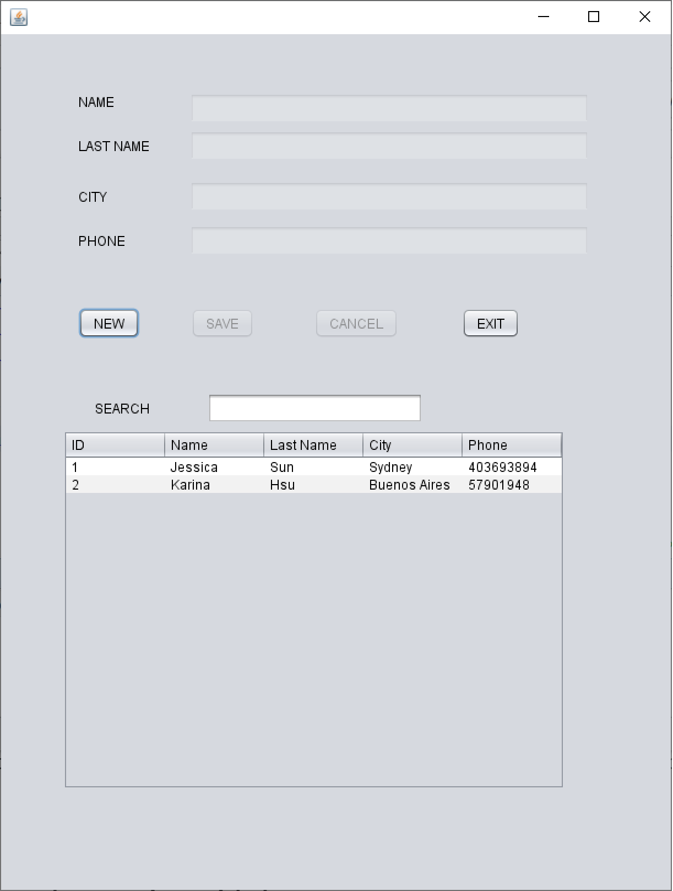
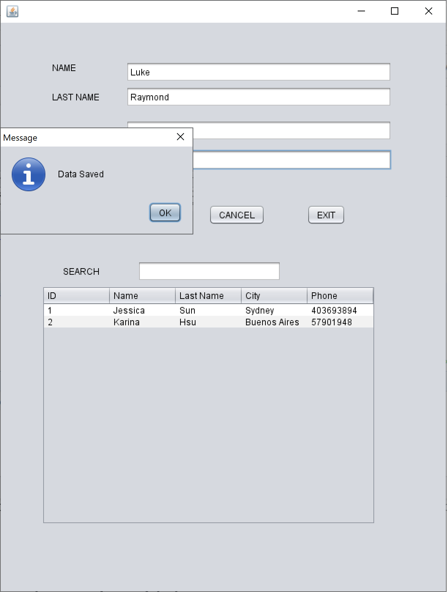
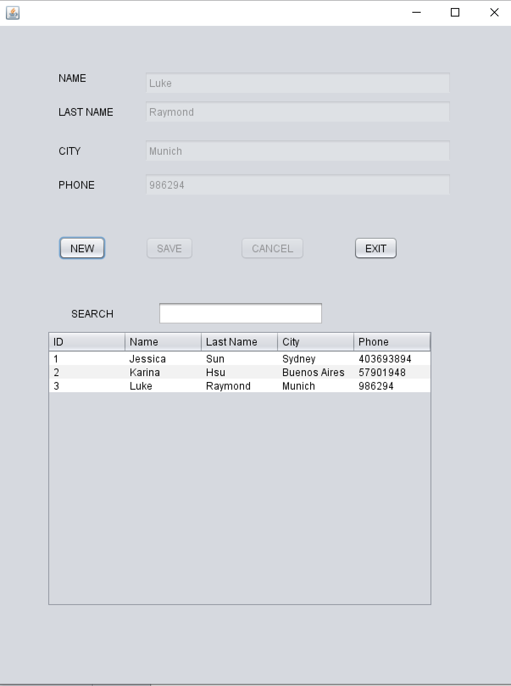
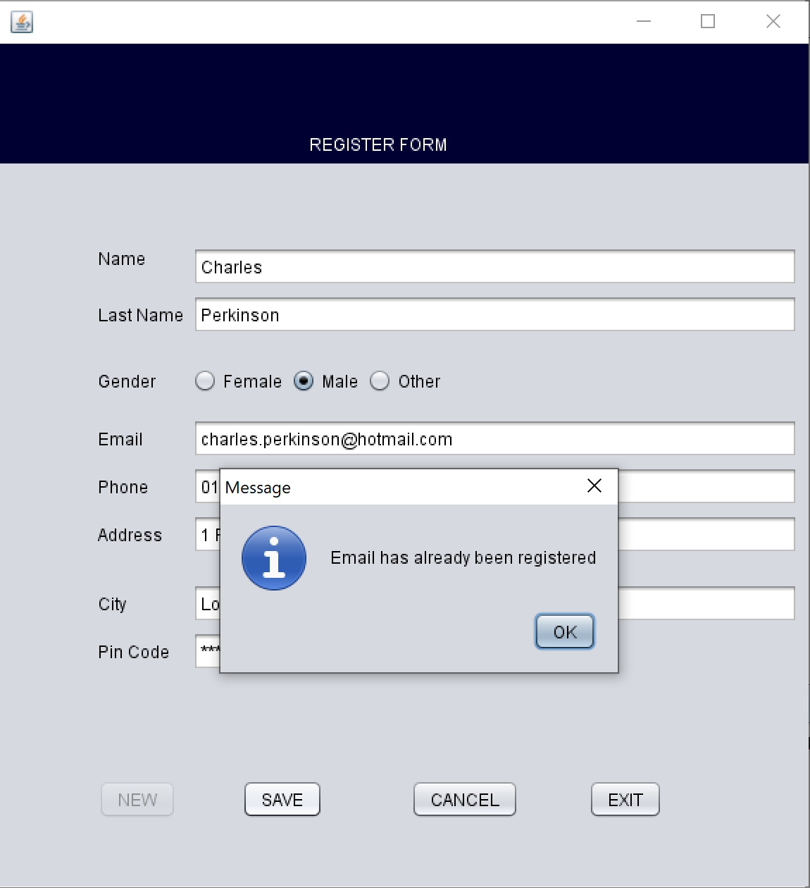
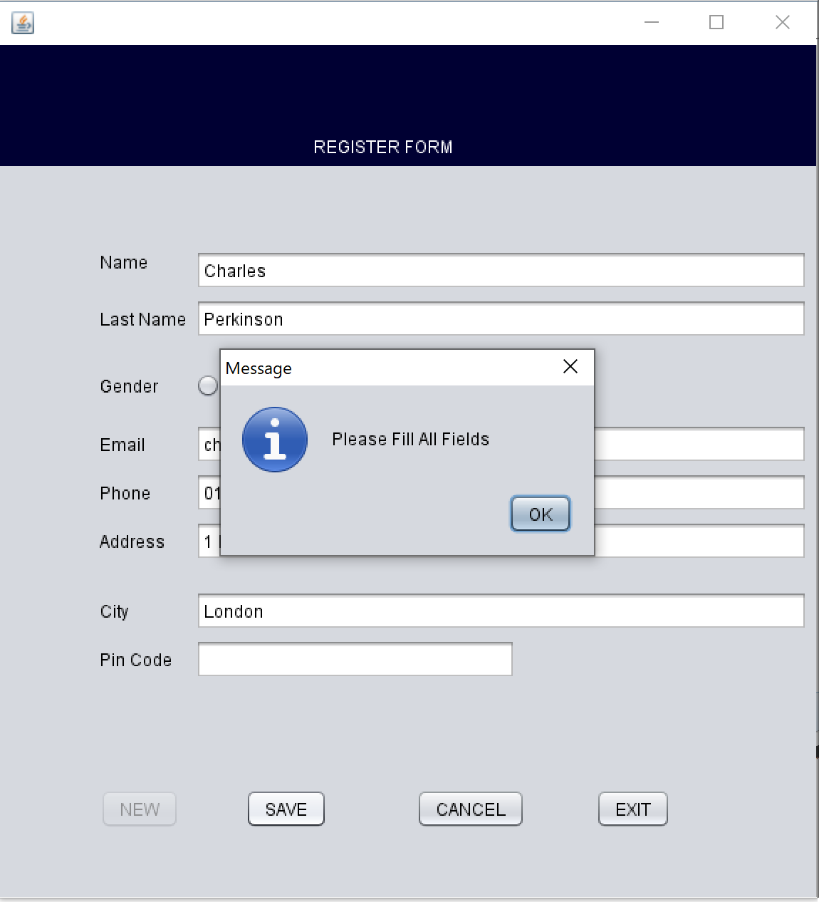
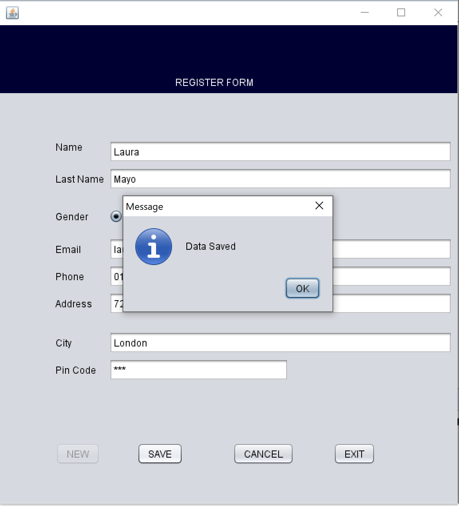
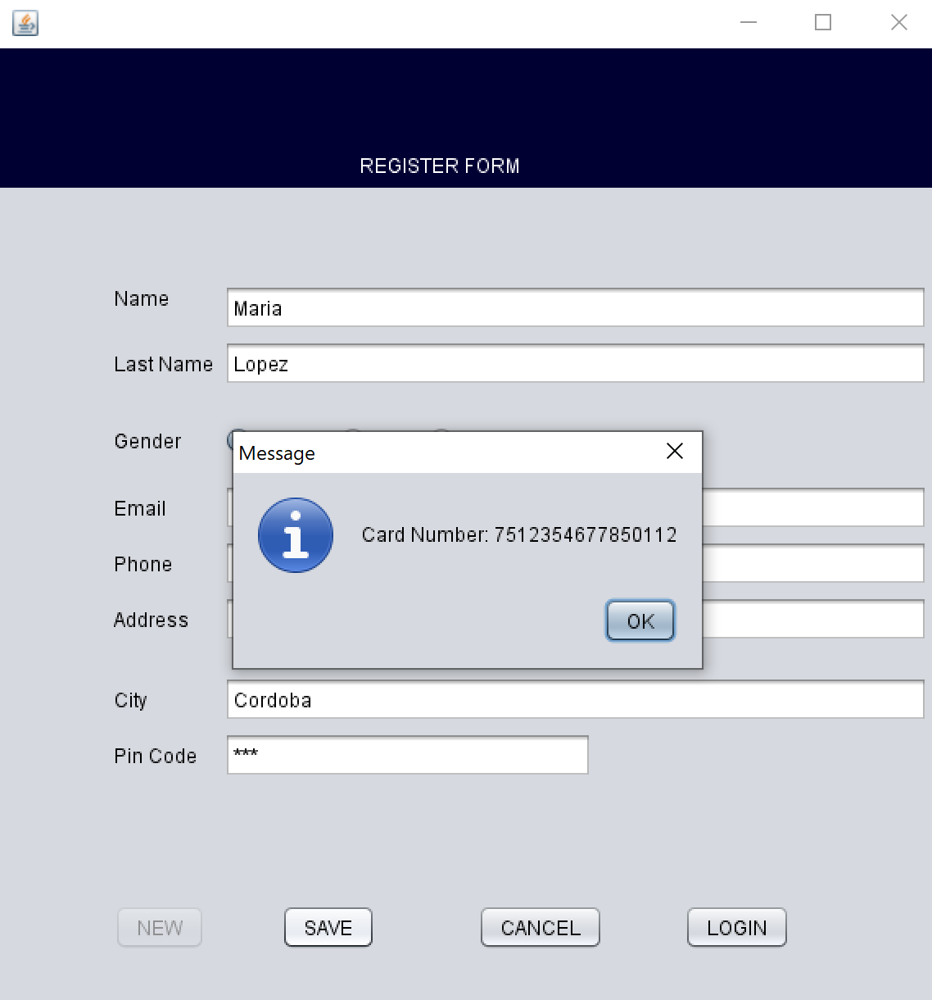
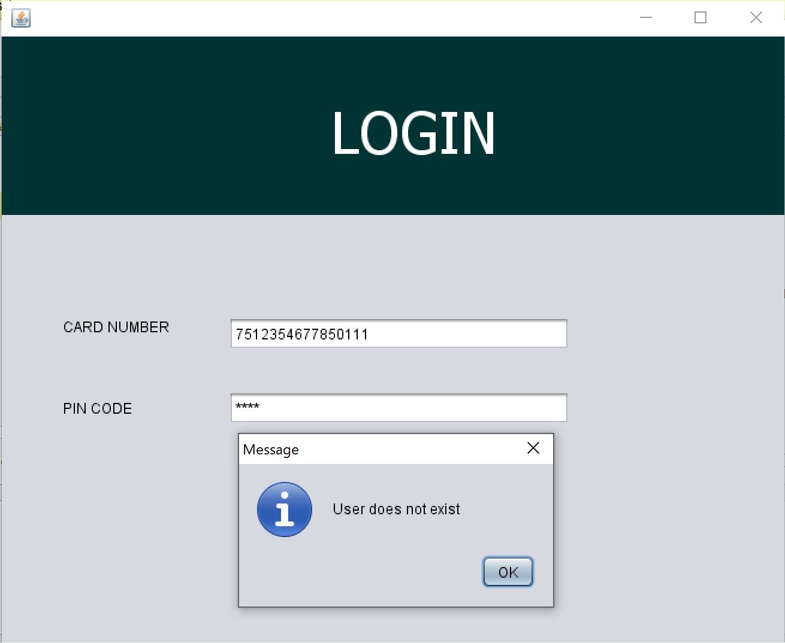
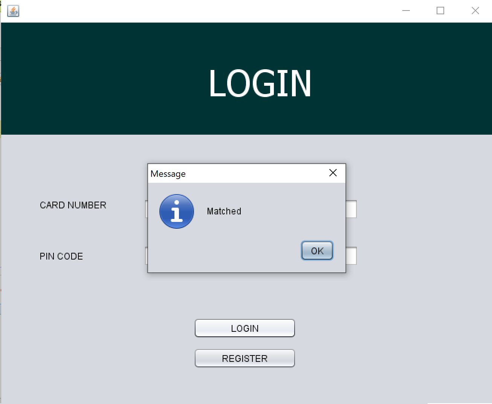

# ATM
This project simulates the common transactions and functionalities of an ATM. A user and log in using its details, it can withdraw money from the ATM, check its balance and deposit money.

***

## Site is Live At:

**Project Start Date:** 13/02/2020

**What This Project Is For Me**
1) Java Practice: the first time I used Java was on my first year at university. After, I had exposure to various other programming skills and their applications. Hence, I wanted to brush up my Java skills by bulding this Java based Bank Management System Simulator.
2) MySQL Pratice: I took a Data & Information Management (ISYS2120) course as part of my degree where I learnt concepts such as Conceptual Data Design, Relational Model and SQL, Logical Schema Design, Queries, among other concepts. However, I didn't quite have the opportunity to create a program and apply those concepts as part of the Database Management. This project allows me to not only review SQL theory but combine them with a platform built by myself, storing data from users, and managing those data.

### Day 1: MySQL DataBase setup and conection with NetBeans in Java (testing)
Basic functionalities like filter search bar, displaying users from database and adding new users

**Register Form**

Work progress: checking all fields have been filled, verifying user has not been registered before, saving all details in DB

 
 

### Day 2: Login form and its link to Register form

Work progress: search up user in DB and validate credentials before logging into the system, randomly generate card number for user with auto increment to store in DB and ensure its uniqueness.

  

## Built with:
* Java 
* JDBC API
* MySQL - Database Management
* NetBeans IDE
