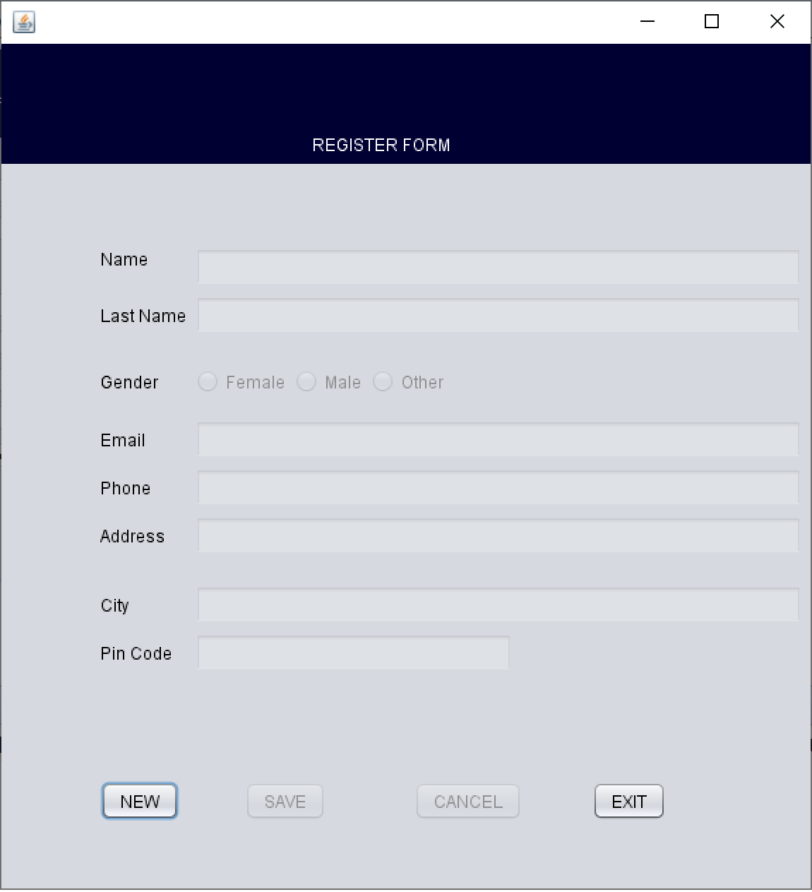
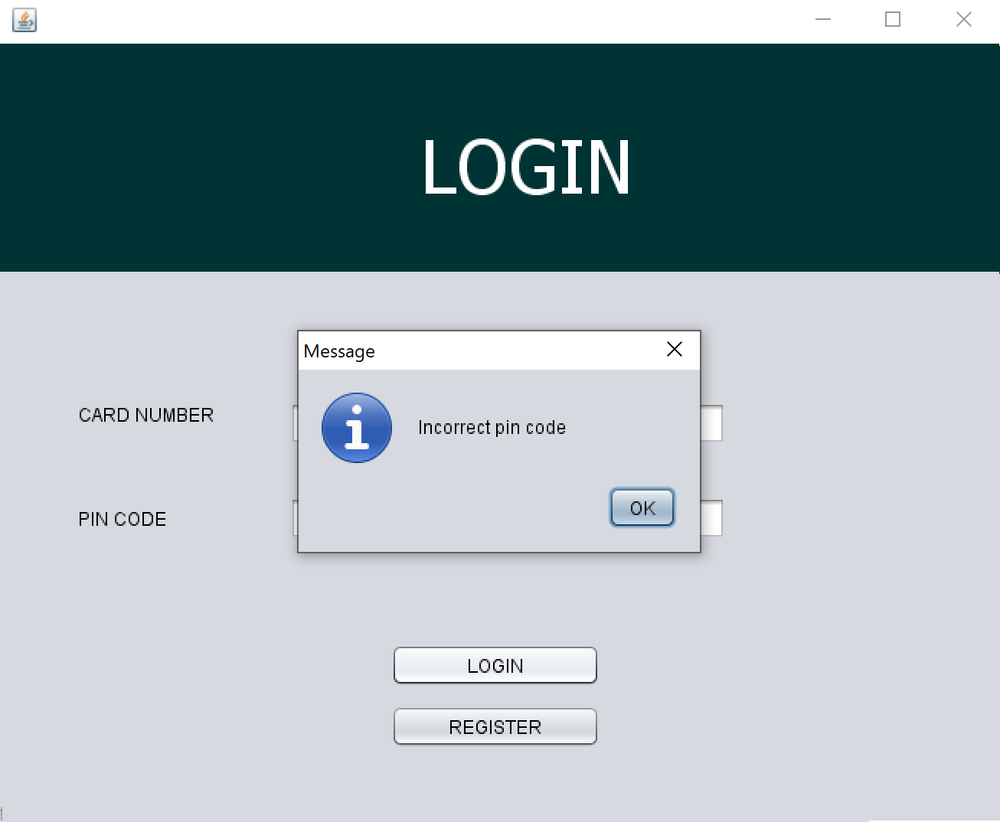

# ATM
This project simulates the common transactions and functionalities of an ATM. A user and log in using its details, it can withdraw money from the ATM, check its balance and deposit money.

***

## Site is Live At:

**Project Start Date:** 13/02/2020

**What This Project Is For Me**
1) Java Practice: 
2) MySQL Pratice:

### Day 1: MySQL DataBase setup and conection with NetBeans in Java (testing)
Basic functionalities like filter search bar, displaying users from database and adding new users

**Register Form**

Work progress: checking all fields have been filled, verifying user has not been registered before, saving all details in DB

### Day 2: Login form and its link to Register form

Work progress: search up user in DB and validate credentials before logging into the system, randomly generate card number for user with auto increment to store in DB and ensure its uniqueness.

## Built with:
* Java 
* JDBC API
* MySQL - Database Management
* NetBeans IDE
